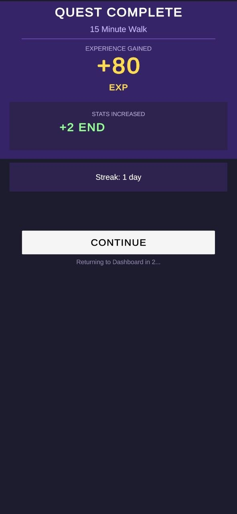
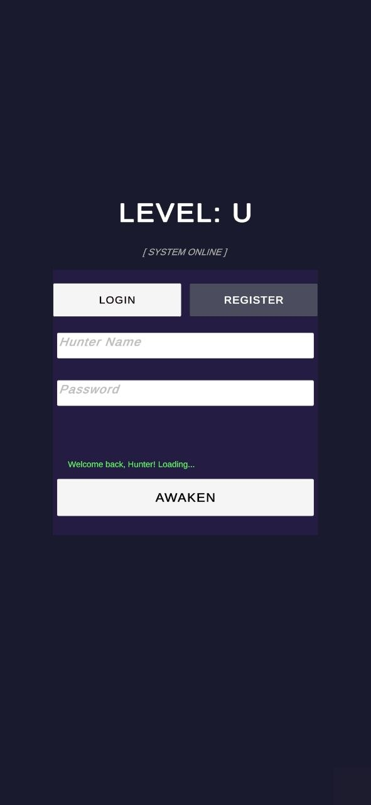
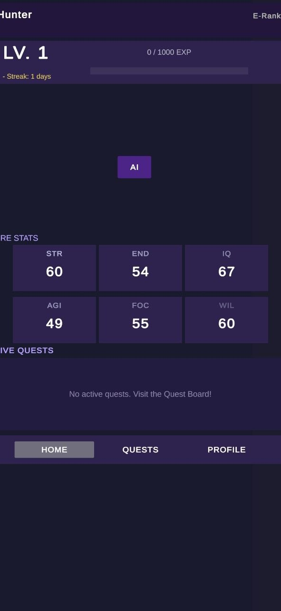
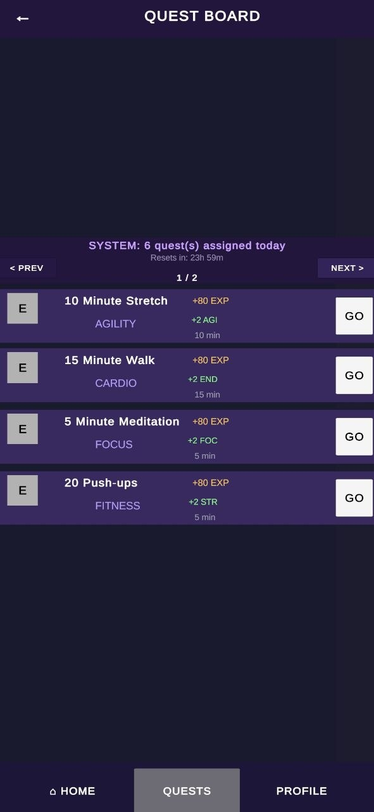
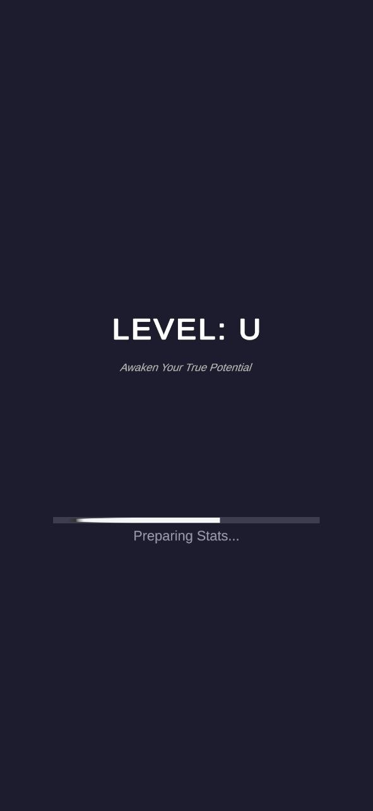
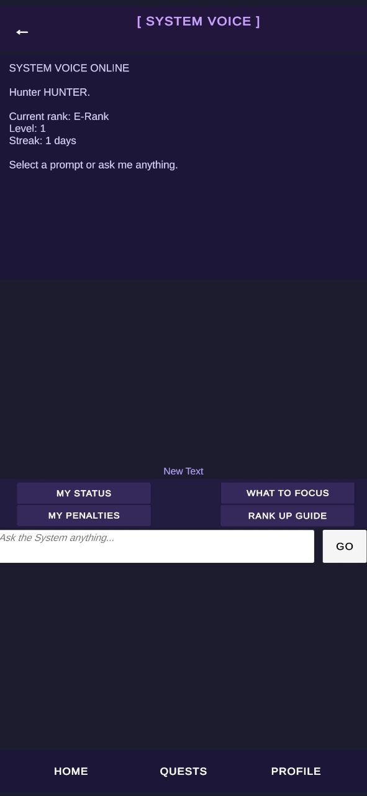
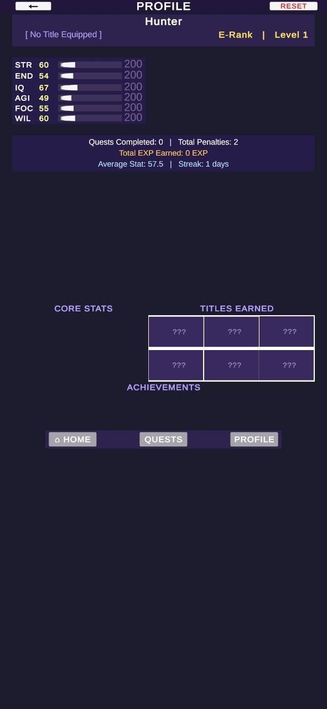
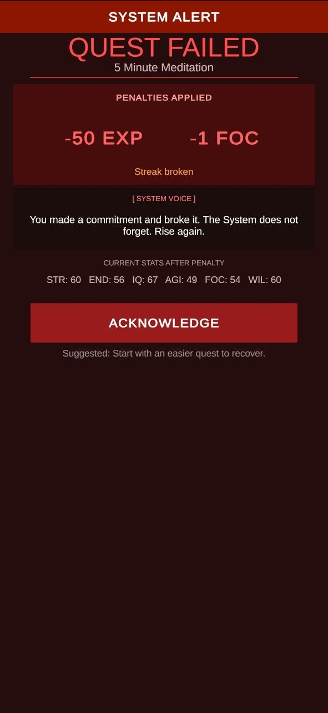

# ⚔️ LEVEL: U
### *Awaken Your True Potential*

> A real-life RPG gamification Android app — complete daily quests to level up your actual stats.

Inspired by **Solo Leveling**, LEVEL: U turns your everyday habits into RPG missions. The System assigns you 6 quests every day. Complete them, earn XP, and level up 6 real stats. Fail them, and the System punishes you.

**Built entirely in Unity 6 from scratch as a solo project.**

---

## 📱 Download

👉 **[Download APK — v1.0](https://github.com/raghvender-singh-shekhawat/LEVEL-U/releases/tag/v1.0.0)**

> Enable "Install from unknown sources" in Android Settings before installing.

---

## 🖼️ Screenshots

<p align="center">
  
  
  
  
  
</p>
<p align="center">
  
  
  
</p>

---

## ⚙️ Core Features

| Feature | Description |
|---|---|
| 🤖 AI Quest Assignment | OpenRouter API generates 6 personalised daily quests |
| 📊 6-Stat System | STR · END · IQ · AGI · FOC · WIL — each tracked independently |
| ⚠️ Penalty System | Miss a quest → lose EXP and stats. *The System does not forget.* |
| 💾 Persistent Save | JSON save system — progress survives app restarts |
| 🎙️ System Voice (AI Coach) | Chat with your AI Coach for status updates and guidance |
| 🎵 Audio System | Scene-persistent background music + SFX |
| 📱 Android Native | Deployed as .APK, tested on real Android device |

---

## 🛠️ Tech Stack

- **Engine:** Unity 6
- **Language:** C#
- **AI:** OpenRouter API (Qwen3-Plus / GPT-OSS-120B)
- **Platform:** Android (.APK)
- **Architecture:** 9 Unity scenes, 9 custom C# manager scripts
- **Save System:** JSON serialization

---

## 🏗️ Architecture

```
9 Scenes: Splash → Login → Home Dashboard → Quest Board
          → Quest Detail → AI Coach → Profile → Settings → Penalty Screen

Key Scripts:
GameManager · PlayerData · QuestData · SaveSystem
QuestAssignmentSystem · AIManager · PenaltyManager
AudioManager · MusicManager
```

---

## 👤 Author

**Raghvender Singh Shekhawat** — B.Tech CSE, Lovely Professional University  
*Solo project — designed, built, and shipped from scratch.*
